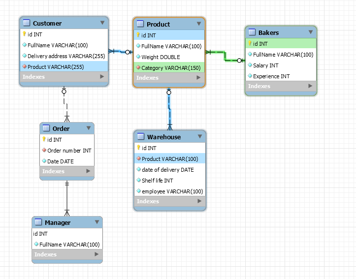

# Объекты которые должны быть включены в ER-диаграмму

Customer - Это сущность,которая будет хранить информацию о покупателях

Product - Это сущность, которая будет хранить информацию о товаре

Bakers - Это сущность, которая будет хранить информацию о пекарях

Warehouse - Это сущность, которая будет хранить информацию о складе

Manager - Это сущность, которая будет хранить информацию о менеджере

Order - Это сущность, которая будет хранить информацию об оплате заказа клиентом

# Определение взаимосвязей между сущностями

Клиент и товар

* Клиент может купить один или более товаров
* Товар может быть куплен одним или более клиентом

Клиент и платежные организации

* Клиент может иметь только одну учётную запись, но может сделать несколько платежей

Товар и пекарь
* Товар может быть создан одним или несколькими пекарями
* Пекарь может создать один или более товаров

* Товар может быть создан из одного или нескольких продуктов со склада

