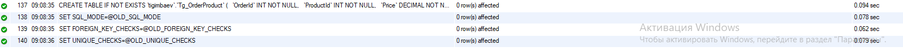
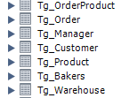

<table style="width: 100%;">
  <tr>
    <td style="text-align: center; border: none;"> 
    Минестерство образования и науки РФ <br>
    ГБПОУ РМЭ "Йошкар-Олинский Технологический колледж </td>
  </tr>
  <tr>
    <td style="text-align: center; border: none; height: 15em;"><h2> Курсовая работа <br> Разработка скрипта для базы данных</h2><br>
    По теме: "Пекарня"
    </td>
  </tr>
  <tr>
    <td style="text-align: right; border: none; height: 20em;">
      Разработал: Игимбаев Тимур<br/>
      Группа: И-31<br/>
      Проверил: Колесников Е.И.       
    </td>
  </tr>
  <tr>
    <td style="text-align: center; border: none; height: 5em;">
    г.Йошкар-Ола, 2021</td>
  </tr>
</table>

<div style="page-break-after: always;"></div>


# Сам скрипт:

```
-- MySQL Script generated by MySQL Workbench
-- Mon Feb 28 08:59:19 2022
-- Model: New Model    Version: 1.0
-- MySQL Workbench Forward Engineering

SET @OLD_UNIQUE_CHECKS=@@UNIQUE_CHECKS, UNIQUE_CHECKS=0;
SET @OLD_FOREIGN_KEY_CHECKS=@@FOREIGN_KEY_CHECKS, FOREIGN_KEY_CHECKS=0;
SET @OLD_SQL_MODE=@@SQL_MODE, SQL_MODE='ONLY_FULL_GROUP_BY,STRICT_TRANS_TABLES,NO_ZERO_IN_DATE,NO_ZERO_DATE,ERROR_FOR_DIVISION_BY_ZERO,NO_ENGINE_SUBSTITUTION';

-- -----------------------------------------------------
-- Schema tigimbaev
-- -----------------------------------------------------

-- -----------------------------------------------------
-- Schema tigimbaev
-- -----------------------------------------------------
CREATE SCHEMA IF NOT EXISTS `tigimbaev` DEFAULT CHARACTER SET utf8 ;
USE `tigimbaev` ;

-- -----------------------------------------------------
-- Table `tigimbaev`.`Tg_Сustomer`
-- -----------------------------------------------------
CREATE TABLE IF NOT EXISTS `tigimbaev`.`Tg_Сustomer` (
  `id` INT NOT NULL AUTO_INCREMENT,
  `FullName` VARCHAR(100) NOT NULL,
  `DeliveryAddress` VARCHAR(255) NOT NULL,
  `Classification` VARCHAR(100) NOT NULL,
  `Phone` VARCHAR(20) NOT NULL,
  PRIMARY KEY (`id`))
ENGINE=InnoDB DEFAULT CHARSET=utf8 COLLATE=utf8_general_ci;


-- -----------------------------------------------------
-- Table `tigimbaev`.`Tg_Bakers`
-- -----------------------------------------------------
CREATE TABLE IF NOT EXISTS `tigimbaev`.`Tg_Bakers` (
  `id` INT NOT NULL AUTO_INCREMENT,
  `FullName` VARCHAR(100) NOT NULL,
  `Salary` FLOAT NOT NULL,
  `Experience` INT NOT NULL,
  `Specialization` VARCHAR(150) NOT NULL,
  PRIMARY KEY (`id`))
ENGINE=InnoDB DEFAULT CHARSET=utf8 COLLATE=utf8_general_ci;


-- -----------------------------------------------------
-- Table `tigimbaev`.`Tg_Product`
-- -----------------------------------------------------
CREATE TABLE IF NOT EXISTS `tigimbaev`.`Tg_Product` (
  `id` INT NOT NULL AUTO_INCREMENT,
  `FullName` VARCHAR(100) NOT NULL,
  `Weight` DOUBLE NOT NULL,
  `Price` FLOAT NOT NULL,
  `Category` VARCHAR(150) NOT NULL,
  PRIMARY KEY (`id`),
  CONSTRAINT `fk_Product_Bakers1`
    FOREIGN KEY (`id`)
    REFERENCES `tigimbaev`.`Tg_Bakers` (`id`)
    ON DELETE NO ACTION
    ON UPDATE NO ACTION)
ENGINE=InnoDB DEFAULT CHARSET=utf8 COLLATE=utf8_general_ci;


-- -----------------------------------------------------
-- Table `tigimbaev`.`Tg_Order`
-- -----------------------------------------------------
CREATE TABLE IF NOT EXISTS `tigimbaev`.`Tg_Order` (
  `id` INT NOT NULL AUTO_INCREMENT,
  `Order number` INT NOT NULL,
  `Date` DATE NOT NULL,
  `Price` FLOAT NOT NULL,
  `PaymentType` VARCHAR(100) NOT NULL,
  PRIMARY KEY (`id`),
  INDEX `fk_Order_Сustomer_idx` (`Order number` ASC) ,
  CONSTRAINT `fk_Order_Сustomer`
    FOREIGN KEY (`Order number`)
    REFERENCES `tigimbaev`.`Tg_Сustomer` (`id`)
    ON DELETE NO ACTION
    ON UPDATE NO ACTION)
ENGINE=InnoDB DEFAULT CHARSET=utf8 COLLATE=utf8_general_ci;


-- -----------------------------------------------------
-- Table `tigimbaev`.`Tg_Manager`
-- -----------------------------------------------------
CREATE TABLE IF NOT EXISTS `tigimbaev`.`Tg_Manager` (
  `id` INT NOT NULL AUTO_INCREMENT,
  `FullName` VARCHAR(100) NOT NULL,
  `Email` VARCHAR(200) NOT NULL,
  `Phone` VARCHAR(20) NOT NULL,
  PRIMARY KEY (`id`))
ENGINE=InnoDB DEFAULT CHARSET=utf8 COLLATE=utf8_general_ci;


-- -----------------------------------------------------
-- Table `tigimbaev`.`Tg_Warehouse`
-- -----------------------------------------------------
CREATE TABLE IF NOT EXISTS `tigimbaev`.`Tg_Warehouse` (
  `id` INT NOT NULL AUTO_INCREMENT,
  `DateOfDelivery` DATE NOT NULL,
  `ShelfLife` INT NOT NULL,
  `Employee` VARCHAR(100) NOT NULL,
  `Product` VARCHAR(150) NOT NULL,
  PRIMARY KEY (`id`),
  CONSTRAINT `fk_Warehouse_Product1`
    FOREIGN KEY (`id`)
    REFERENCES `tigimbaev`.`Tg_Product` (`id`)
    ON DELETE NO ACTION
    ON UPDATE NO ACTION)
ENGINE=InnoDB DEFAULT CHARSET=utf8 COLLATE=utf8_general_ci;


-- -----------------------------------------------------
-- Table `tigimbaev`.`Tg_OrderProduct`
-- -----------------------------------------------------
CREATE TABLE IF NOT EXISTS `tigimbaev`.`Tg_OrderProduct` (
  `OrderId` INT NOT NULL,
  `ProductId` INT NOT NULL,
  `Price` DECIMAL NOT NULL,
  `Number` INT NOT NULL,
  PRIMARY KEY (`OrderId`, `ProductId`),
  INDEX `fk_Order_has_Product_Product1_idx` (`ProductId` ASC) ,
  INDEX `fk_Order_has_Product_Order1_idx` (`OrderId` ASC) ,
  CONSTRAINT `fk_Order_has_Product_Order1`
    FOREIGN KEY (`OrderId`)
    REFERENCES `tigimbaev`.`Tg_Order` (`id`)
    ON DELETE NO ACTION
    ON UPDATE NO ACTION,
  CONSTRAINT `fk_Order_has_Product_Product1`
    FOREIGN KEY (`ProductId`)
    REFERENCES `tigimbaev`.`Tg_Product` (`id`)
    ON DELETE NO ACTION
    ON UPDATE NO ACTION)
ENGINE=InnoDB DEFAULT CHARSET=utf8 COLLATE=utf8_general_ci;


SET SQL_MODE=@OLD_SQL_MODE;
SET FOREIGN_KEY_CHECKS=@OLD_FOREIGN_KEY_CHECKS;
SET UNIQUE_CHECKS=@OLD_UNIQUE_CHECKS;
```
# Результат выполнения скрипта:





