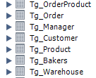

<table style="width: 100%;">
  <tr>
    <td style="text-align: center; border: none;"> 
    Минестерство образования и науки РФ <br>
    ГБПОУ РМЭ "Йошкар-Олинский Технологический колледж </td>
  </tr>
  <tr>
    <td style="text-align: center; border: none; height: 15em;"><h2> Курсовая работа</h2><br>
    По теме: "Пекарня"
    </td>
  </tr>
  <tr>
    <td style="text-align: right; border: none; height: 20em;">
      Разработал: Игимбаев Тимур<br/>
      Группа: И-31<br/>
      Проверил: Колесников Е.И.       
    </td>
  </tr>
  <tr>
    <td style="text-align: center; border: none; height: 5em;">
    г.Йошкар-Ола, 2021</td>
  </tr>
</table>

<div style="page-break-after: always;"></div>

# Содержание

* [Описание предметной области](#описание-предметной-области)
* [Диграмма прецендентов](#диаграмма-прецендентов)
* [Спецификация прецендентов](#спецификация-прецендентов)
* [ER-Диаграмма в PDF](Base/Base.pdf)
* [Изображение ER-диаграммы](#er-диаграмма)
* [Описание ER-Диаграммы](#описание-er-диаграммы)
* [TestCase](#test-cases)
* [Скрипт Базы данных](#скрипт-базы-данных)
* [Структрура Базы данных](#база-данных-на-mysql)
* [Диаграмма взаимодействия](Classes/interactionDiagram.pdf)
* [Диаграмма состояний](Classes/Automat.pdf)
* [WireFrame](Classes/WireFrame.pdf)
* [C# Project](#проект-на-c)
* [API](#api)

# Описание предметной области


Наша компания занимается продажами хлебобулочной продукции, реализация ее продажи осуществляется с помощоью онлайн заказов. Продажа осуществляется в любых колличествах, предоставляется возможность закупки оптовой партии. Наши менеджеры могут проконсультировать наших покупателей в режиме диалога по входящей линии. Кроме того менеджеры определяют цены на товары и заказы, ведут учёт заказов и создают новые акции и скидки.

Товар который мы продаём создается из высококачественных и свежих продуктов. Отдел по контролю качество строго следит за этим и ведёт учёт поставляемой продукции для создания товара по ГОСТу.
Производство продаваемого товара ведётся в цехах, которые также строго контролируются, в них проводится генеральная уборка и кварцевание перед началом работ по производсту товара и по окончанию рабочего дня. Наши пекари работают посменно и в разных цехах. По нашим пекарям нам очень важно хранить информацию о медицинском осмотре, информацию для отдела кадров и бухгалтерии, а именно ФИО, дату рождения, паспортные данные, банковские реквизиты. На каждый тип продукции у нас есть отдельная группа сотрудников, которые работают совместно. Всего у нас 4 типа продукции:
1. Пироги;
2. Пирожки;
3. Торты;
4. Хлеб; 

Также для каждого из этих видов продукции есть отдельное конткретное обуродвание, требующее наличие специализации. За каждым видом оборудования и её описанием,следят мастера производства из отдела контроля качества.
Для производства каждого вида продукции используются несколько типов сырья, нам очень важно постоянно иметь актуальную информацию об остатке сырья на складе. Информация которая важна для сырья из которого изготавливается конечный продукт:
1. Наименование;
2. Вес в одной упаковке;
3. Минимальное допустимое колличество;
4. Дата поставки сырья;
5. Дата производства сырья;

Вся история изменений количества материалов на складе, их обновление, их отсутсвтие и отпуск сырья на проивзодство фиксируется сотрудниками склада, они ведут ежедневный учёт истории сырья.

В наших цехах есть система безопасности. Войти в наш цех можно только строго по пропускам, через турникеты, также ведётся учёт прихода сотрудника в цех, фиксируется дата и время его визита, это также помогает контролировать его отработанные часы, фиксировать опаздания, либо же преждевременный уход с рабочего места. Кроме того каждый цех охраняется охарнным предприятем. А также есть возможность развоза сотрудников по домам в вечернее время, если сотрудник задержался на рабочем месте.

Так как мы можем продавать товар в неограниченных колличествах, не редко нашими заказчиками являются другие компании. Нам важно знать какой компании мы продаем товар, по этому покупающая компания должна предоставить нам инофрмацию о своём предприятии: паспорт предприятия и краткая характеристика предприятия. 
Оплатить товар можно перед получением товара, либо же после его получения. Доставка осуществляется бесплатно, есть возможность доставить товар с помощью курьерской службы самого заказчика.

Описание товара в каталоге доведено до максимальной полноты инфомарции о продукте: артикул, наименование, тип продукции, изображение, стоимость за одну штуку, дата изготовления, вес без упаковки, номер стандарта (ГОСТ). 
Если же у клиента возникнут вопросы о товаре, он всегда может обратиться по номеру горячий линии, наши сотрудники ответят в течение 5 минут.


# Диаграмма прецендентов


# Спецификация прецендентов

Значение  | Содержание
:---:|---:
Прецедент | Оформление заказа
Идентификатор | ID 1
Краткое описание | Клиент консультируется с мендежером
Главные акторы | Клиент
Второстепенные акторы | Менеджер
Предусловия | Нет
Основной поток | 1. Прецедент начинается, когда клиент задаёт вопрос менеджеру <br/>2. Менеджер консультирует клиента
Альтернативные потоки | нет
Постусловия | 1. Покупатель усвоил информацию о товаре

Значение | Содержание
:---:|---:
Прецедент | Заказ товара
Идентификатор | ID 2
Краткое описание | Клиент заказывает товар
Главные акторы | Клиент
Второстепенные акторы | Менеджер
Предусловия | Нет
Основной поток | 1. Прецедент начинается, когда клиент заказывает товар <br/>2. Менеджер принимает заказ
Альтернативные потоки | нет
Постусловия | 1. Клиент оставил заказ <br/> 2. Клиент отказался от заказа


Значение | Содержание
:---:|---:
Прецедент | Создание товара
Идентификатор | ID 3
Краткое описание | Пекарь создаёт товар
Главные акторы | Клиент
Второстепенные акторы | Мастер отдела качества
Предусловия | Нет
Основной поток | 1. Прецедент начинается, когда пекарь создает товар <br/>2. Мастер отдела качества контролирует качества товара.<br/>3. Если товар качественный <br/>
Альтернативные потоки | 3.1 Мастер отправляет товар на продажу
Постусловия |1. Товар качественный и отправлен на продажу <br/> 2. Товар некачественный и не может отправиться на продажу.


Значение | Содержание
:---:|---:
Прецедент |Описание характеристик товара
Идентификатор | ID 4
Краткое описание | Менеджер создаёт описания товара
Главные акторы | Менеджер
Второстепенные акторы | Клиент
Предусловия | Нет
Основной поток | 1. Прецедент начинается, когда менеджер создаёт описание характерстики товара <br/>2. Если  клиенту не понятны характеристики товара товара<br/>
Альтернативные потоки | 2.1 Менеджер консультирует клиента
Постусловия |1. Клиенту понятен товар <br/>

Значение | Содержание
:---:|---:
Прецедент | Определение цены на товары и заказы
Идентификатор | ID 5
Краткое описание | Менеджер создаёт цены на товары и заказы
Главные акторы | Менеджер
Второстепенные акторы | Клиент
Предусловия | Нет
Основной поток | 1. Прецедент начинается, когда менеджер создаёт цены на товары и заказы <br/>2. Клиент ознакамливается с ценами на товары<br/>3. Если клиенту не понятна ценовая политика
Альтернативные потоки | 3.1 Менеджер консультирует клиента
Постусловия |1. Клиент узнаёт цены на товар и на заказ. <br/> 

# ER Диаграмма


# Описание ER диаграммы

Customer - Это сущность,которая будет хранить информацию о покупателях

Product - Это сущность, которая будет хранить информацию о товаре

Bakers - Это сущность, которая будет хранить информацию о пекарях

Warehouse - Это сущность, которая будет хранить информацию о складе

Manager - Это сущность, которая будет хранить информацию о менеджере

Order - Это сущность, которая будет хранить информацию об оплате заказа клиентом

_**Определение взаимосвязей между сущностями**_

Клиент и товар

* Клиент может купить один или более товаров
* Товар может быть куплен одним или более клиентом

Товар и пекарь
* Товар может быть создан одним или несколькими пекарями
* Пекарь может создать один или более товаров

* Товар может быть создан из одного или нескольких продуктов со склада

# Test Cases

Тестовый пример #1:

&nbsp;|&nbsp;| Мои комментарии
---|---|---
Тестовый пример# | TC_DP_1 | Расшифровывается: TestCase_DeleteProduct_1
Приоритет тестирования| Средний | Бизнес-правило
Заголовок|Удаление товара
Краткое изложение теста | Должно произойти удаление товара
Этапы теста | 1. Добавить данные в FakeDataProvider; <br> 2. Вызывать метод удаления товара; <br> 3.Проверить наличие удаленной записи
Тестовые данные | Название: Булочка с маком; <br> Производитель: ИП Игимбаев Т.Е.; <br> Цена: 58 рублей; <br>Вес: 100 грамм; 
Ожидаемый результат: | Запись должна быть удалена
Фактический результат: | Запись удалена
Статус | Зачёт
Предварительное условие | Должен быть создан FakeDataProvider с внесенными в него записями
Постусловие | Список товаров должен уменьшиться на один
Примечания/Комментарии | Т.к. мы удаляли товар без продаж, то ошибок быть не может не по вине кода ни по ограничениям базы


Тестовый пример #2: 

&nbsp;|&nbsp;| Мои комментарии
---|---|---
Тестовый пример# | TC_DP_2 | Расшифровывается: TestCase_DeleteProduct_2
Приоритет тестирования | Средний | Бизнес-правило
Заголовок | Удаление товара по которому была совершена продажа, с предварительной проверкой наличия продажи
Краткое изложение теста | Удаление товара должно не произойти, так как по нему были совершены продажи
Этапы теста | 1. Добавить данные в FakeDataProvider;<br> 2.Вызвать метод удаления; <br>3. Проверить наличие удаленной записи
Тестовые данные |Название: Булочка с маком; <br> Производитель: ИП Игимбаев Т.Е.; <br> Цена: 58 рублей; <br>Вес: 100 грамм;
Ожидаемый результат: | Запись не должна удалиться
Фактический результат: | Запись не удалилась
Статус:| Зачёт
Предварительное условие: | Должна быть создана запись товара, по которому была совершена продажа, в FakeDataProvider
Постусловие: | Список товаров должен остаться без изменений
Примечания/Комментарии | Т.к мы удаляли товар по которому была совершена продажа и удаление не произошло, то ошибок быть не может

Тестовый пример #3: 

&nbsp;|&nbsp;| Мои комментарии
---|---|---
Тестовый пример# | TC_DP_3 | Расшифровывается: TestCase_DeleteProduct_3
Приоритет тестирования | Средний | Бизнес-правило
Заголовок | Удаление несуществущего товара | Товара не существует в базе данных
Краткое изложение теста | Удаление товара не должно произойти, удаляемого элемента не существует
Этапы теста | 1.Вызвать метод удаления; <br>2.Проверить результат;
Тестовые данные |Название: Булочка с маком; <br> Производитель: ИП Игимбаев Т.Е.; <br> Цена: 58 рублей; <br>Вес: 100 грамм;
Ожидаемый результат: | Запись не должна удалиться
Фактический результат: | Запись не удалилась
Статус:| Зачёт
Предварительное условие: | У удаляемого товара ID должен быть равен нулю | Товара нет в базе данных
Постусловие: | Список товаров должен остаться без изменений
Примечания/Комментарии | Т.к мы удаляли товар ID которого равен нулю, то удаление не должно произойти, следовательно ошибок быть не может.

Тестовый пример #4:

&nbsp;|&nbsp;| Мои комментарии
---|---|---
Тестовый пример# | TC_DP_4 | Расшифровывается: TestCase_DeleteProduct_4
Приоритет тестирования | Средний | Бизнес-правило
Заголовок: | Удаление товара по которому была совершена продажа без предварительной проверки
Краткое изложение теста | Приложение должно показать ошибку, говорящую о том, что удаление невозможно
Этапы теста | 1. Вызвать метод удаления<br>2. Проверить результат выполнения метода
Тестовые данные | Название: Булочка с маком; <br> Производитель: ИП Игимбаев Т.Е.; <br> Цена: 58 рублей; <br>Вес: 100 грамм;
Ожидаемый результат | Запись не должна удалиться, в результате мы получили ошибку
Статус | Зачёт
Предварительное условие | У товара должны быть продажи
Постусловие | Всё должно остаться без изменений

Тестовый пример #5: 

&nbsp;|&nbsp;| Мои комментарии
---|---|---
Тестовый пример # | TC_DP_5 | Расшифровывается: TestCase_DeleteProduct_5
Приоритет тестирования | Средний | Бизнес правило
Заголовок | Удаление нескольких товаров без продаж
Краткое изложение теста | Выделение нескольких товаров и их удаление
Этапы теста | 1. Выбрать товары<br>2.Вызвать методу удаление <br>3.Проверить результат выполнения метода
Тестовые данные |  1. <br> Название: Булочка с маком; <br> Производитель: ИП Игимбаев Т.Е.; <br> Цена: 58 рублей; <br>Вес: 100 грамм; <br>2. Название: Сосиска в тесте; <br> Производитель: ИП Игимбаев Т.Е.; <br> Цена: 50 рублей; <br>Вес: 120 грамм;
Ожидаемый результат | Записи должны удалиться
Статус | Зачёт
Предварительное условие | Должно быть выбрано несколько товаров, по которому не было совершено продаж
Постусловие | Должно произойти удаление


# Скрипт Базы Данных:

```
-- MySQL Script generated by MySQL Workbench
-- Mon Feb 28 08:59:19 2022
-- Model: New Model    Version: 1.0
-- MySQL Workbench Forward Engineering

SET @OLD_UNIQUE_CHECKS=@@UNIQUE_CHECKS, UNIQUE_CHECKS=0;
SET @OLD_FOREIGN_KEY_CHECKS=@@FOREIGN_KEY_CHECKS, FOREIGN_KEY_CHECKS=0;
SET @OLD_SQL_MODE=@@SQL_MODE, SQL_MODE='ONLY_FULL_GROUP_BY,STRICT_TRANS_TABLES,NO_ZERO_IN_DATE,NO_ZERO_DATE,ERROR_FOR_DIVISION_BY_ZERO,NO_ENGINE_SUBSTITUTION';

-- -----------------------------------------------------
-- Schema tigimbaev
-- -----------------------------------------------------

-- -----------------------------------------------------
-- Schema tigimbaev
-- -----------------------------------------------------
CREATE SCHEMA IF NOT EXISTS `tigimbaev` DEFAULT CHARACTER SET utf8 ;
USE `tigimbaev` ;

-- -----------------------------------------------------
-- Table `tigimbaev`.`Tg_Сustomer`
-- -----------------------------------------------------
CREATE TABLE IF NOT EXISTS `tigimbaev`.`Tg_Сustomer` (
  `id` INT NOT NULL AUTO_INCREMENT,
  `FullName` VARCHAR(100) NOT NULL,
  `DeliveryAddress` VARCHAR(255) NOT NULL,
  `Classification` VARCHAR(100) NOT NULL,
  `Phone` VARCHAR(20) NOT NULL,
  PRIMARY KEY (`id`))
ENGINE=InnoDB DEFAULT CHARSET=utf8 COLLATE=utf8_general_ci;


-- -----------------------------------------------------
-- Table `tigimbaev`.`Tg_Bakers`
-- -----------------------------------------------------
CREATE TABLE IF NOT EXISTS `tigimbaev`.`Tg_Bakers` (
  `id` INT NOT NULL AUTO_INCREMENT,
  `FullName` VARCHAR(100) NOT NULL,
  `Salary` FLOAT NOT NULL,
  `Experience` INT NOT NULL,
  `Specialization` VARCHAR(150) NOT NULL,
  PRIMARY KEY (`id`))
ENGINE=InnoDB DEFAULT CHARSET=utf8 COLLATE=utf8_general_ci;


-- -----------------------------------------------------
-- Table `tigimbaev`.`Tg_Product`
-- -----------------------------------------------------
CREATE TABLE IF NOT EXISTS `tigimbaev`.`Tg_Product` (
  `id` INT NOT NULL AUTO_INCREMENT,
  `FullName` VARCHAR(100) NOT NULL,
  `Weight` DOUBLE NOT NULL,
  `Price` FLOAT NOT NULL,
  `Category` VARCHAR(150) NOT NULL,
  PRIMARY KEY (`id`),
  CONSTRAINT `fk_Product_Bakers1`
    FOREIGN KEY (`id`)
    REFERENCES `tigimbaev`.`Tg_Bakers` (`id`)
    ON DELETE NO ACTION
    ON UPDATE NO ACTION)
ENGINE=InnoDB DEFAULT CHARSET=utf8 COLLATE=utf8_general_ci;


-- -----------------------------------------------------
-- Table `tigimbaev`.`Tg_Order`
-- -----------------------------------------------------
CREATE TABLE IF NOT EXISTS `tigimbaev`.`Tg_Order` (
  `id` INT NOT NULL AUTO_INCREMENT,
  `Order number` INT NOT NULL,
  `Date` DATE NOT NULL,
  `Price` FLOAT NOT NULL,
  `PaymentType` VARCHAR(100) NOT NULL,
  PRIMARY KEY (`id`),
  INDEX `fk_Order_Сustomer_idx` (`Order number` ASC) ,
  CONSTRAINT `fk_Order_Сustomer`
    FOREIGN KEY (`Order number`)
    REFERENCES `tigimbaev`.`Tg_Сustomer` (`id`)
    ON DELETE NO ACTION
    ON UPDATE NO ACTION)
ENGINE=InnoDB DEFAULT CHARSET=utf8 COLLATE=utf8_general_ci;


-- -----------------------------------------------------
-- Table `tigimbaev`.`Tg_Manager`
-- -----------------------------------------------------
CREATE TABLE IF NOT EXISTS `tigimbaev`.`Tg_Manager` (
  `id` INT NOT NULL AUTO_INCREMENT,
  `FullName` VARCHAR(100) NOT NULL,
  `Email` VARCHAR(200) NOT NULL,
  `Phone` VARCHAR(20) NOT NULL,
  PRIMARY KEY (`id`))
ENGINE=InnoDB DEFAULT CHARSET=utf8 COLLATE=utf8_general_ci;


-- -----------------------------------------------------
-- Table `tigimbaev`.`Tg_Warehouse`
-- -----------------------------------------------------
CREATE TABLE IF NOT EXISTS `tigimbaev`.`Tg_Warehouse` (
  `id` INT NOT NULL AUTO_INCREMENT,
  `DateOfDelivery` DATE NOT NULL,
  `ShelfLife` INT NOT NULL,
  `Employee` VARCHAR(100) NOT NULL,
  `Product` VARCHAR(150) NOT NULL,
  PRIMARY KEY (`id`),
  CONSTRAINT `fk_Warehouse_Product1`
    FOREIGN KEY (`id`)
    REFERENCES `tigimbaev`.`Tg_Product` (`id`)
    ON DELETE NO ACTION
    ON UPDATE NO ACTION)
ENGINE=InnoDB DEFAULT CHARSET=utf8 COLLATE=utf8_general_ci;


-- -----------------------------------------------------
-- Table `tigimbaev`.`Tg_OrderProduct`
-- -----------------------------------------------------
CREATE TABLE IF NOT EXISTS `tigimbaev`.`Tg_OrderProduct` (
  `OrderId` INT NOT NULL,
  `ProductId` INT NOT NULL,
  `Price` DECIMAL NOT NULL,
  `Number` INT NOT NULL,
  PRIMARY KEY (`OrderId`, `ProductId`),
  INDEX `fk_Order_has_Product_Product1_idx` (`ProductId` ASC) ,
  INDEX `fk_Order_has_Product_Order1_idx` (`OrderId` ASC) ,
  CONSTRAINT `fk_Order_has_Product_Order1`
    FOREIGN KEY (`OrderId`)
    REFERENCES `tigimbaev`.`Tg_Order` (`id`)
    ON DELETE NO ACTION
    ON UPDATE NO ACTION,
  CONSTRAINT `fk_Order_has_Product_Product1`
    FOREIGN KEY (`ProductId`)
    REFERENCES `tigimbaev`.`Tg_Product` (`id`)
    ON DELETE NO ACTION
    ON UPDATE NO ACTION)
ENGINE=InnoDB DEFAULT CHARSET=utf8 COLLATE=utf8_general_ci;


SET SQL_MODE=@OLD_SQL_MODE;
SET FOREIGN_KEY_CHECKS=@OLD_FOREIGN_KEY_CHECKS;
SET UNIQUE_CHECKS=@OLD_UNIQUE_CHECKS;
```
# Результат выполнения скрипта:




# База данных на MySQL

После выполнения скрипта и импорта данных из файлов, таблицы содержали в себе следующие данные: 

**Таблица Product:**


**Структура таблицы продуктов:**


**Таблица Order:**


**Структура таблицы продуктов:**


**Таблица OrderProduct:**


**Структура таблицы OrderProduct:**


# Проект на C#

Проект на C# выполнен с помощью технологии WPF, приложение для администрирование базы данных
- **Функциональность приложения**: 

    - добавление
    - редактирование
    - удаление
    - поиск
    - фильтрация
    - сортировка

- **Реализация приложения**:
  - Получение продуктов из базы данных:
    1. На первом этапе я создал  модель продуктов
    ```
    public class Product
    {
        public int id { get; set; }
        public string FullName { get; set; }
        public string Weight { get; set; }
        public decimal Price { get; set; }
        public string Image { get; set; }
     
        public ProductType CurrentProductType { get; set; }
        
        public Uri ImageView
        {
            get
            {
                var ImageName = Environment.CurrentDirectory + (Image ?? "");
                return System.IO.File.Exists(ImageName) ? new Uri(ImageName) : null;
            }
            set
            {

            }
        }
      ```
      2. Далее в интерфейсе IDataProvider создал метод для получения продуктов из базы данных: 
      ```
      // Метод получения продуктов
        IEnumerable<Product> GetProduct();
      ```
      3. В классе MySqlDataProvider реализовал метод:
      ```
       // Реализация метода получения продукта
        public IEnumerable<Product> GetProduct()
        {
            GetProductTypes();

            List<Product> ProductList = new List<Product>();
            string Query = @"SELECT p.*, pt.`Name`
                        FROM Tg_Product p
                        LEFT JOIN
                        Tg_ProductType pt ON p.CategoryId = pt.ID;";
            try
            {
                Connection.Open();
                try
                {
                    MySqlCommand Command = new MySqlCommand(Query, Connection);
                    MySqlDataReader Reader = Command.ExecuteReader();
                    while (Reader.Read())
                    {
                        Product NewProduct = new Product();
                        NewProduct.id = Reader.GetInt32("id");
                        NewProduct.FullName = Reader.GetString("FullName");
                        NewProduct.Weight = Reader.GetString("Weight");
                        NewProduct.Price = Reader.GetDecimal("Price");
                        NewProduct.Image = Reader["Image"].ToString();
                        
                        NewProduct.CurrentProductType = GetProductType(Reader.GetInt32("CategoryId"));
                        ProductList.Add(NewProduct);
                    }
                }
                finally
                {
                    Connection.Close();
                }
            }
            catch (Exception)
            {

            }
            return ProductList;
        }
      ```
     4. Создал класс Globals, чтобы получать методы с интерфейса в любом месте кода: 
     ```
     public class Globals
    {
        public static IDataProvider DataProvider;
    }
    ``` 
    5. Далее в главном окне получил продукты в созданный лист продуктов, для которого был реализован GET и SET(чтение и запись), но об этом чуть позже
    ```
       public IEnumerable<Product> ProductList
        {
            // Реализация поиска/фильтрации/сортировки
            get
            {
                var Result = _ProductList;
                if (ProductTypeFilterid > 0)
                    Result = Result.Where(p => p.CurrentProductType.ID == ProductTypeFilterid);
                switch (SortType)
                {
                    case 1:
                        Result = Result.OrderBy(p => p.FullName);
                        break;

                        case 2:
                        Result = Result.OrderByDescending(p => p.FullName);
                        break;
                        
                        case 3:
                        Result = Result.OrderByDescending(p => p.Weight);
                        break;
                        case 4:
                        Result = Result.OrderBy(p => p.Weight);
                        break;
                    case 5:
                        Result = Result.OrderByDescending(p => p.Price);
                        break;
                    case 6:
                        Result = Result.OrderBy(p => p.Price);
                        break;
                        
                }
                
                // ищем вхождение строки фильтра в названии и описании объекта без учета регистра
                if (SearchFilter != "")
                    Result = Result.Where(
                        p => p.FullName.IndexOf(SearchFilter, StringComparison.OrdinalIgnoreCase) >= 0 ||
                        (p.CurrentProductType!=null && p.CurrentProductType.Name.IndexOf(SearchFilter, StringComparison.OrdinalIgnoreCase) >= 0)


                    );


                return Result;
            }
            set
            {
                _ProductList = value;
                Invalidate();
            }
        }
      ```
    6. В конструкторе главного окна получил метод получения продуктов:
    ```
     public MainWindow()
        {
            InitializeComponent();
            DataContext = this;
            // Получение данных в главное окно
            Globals.DataProvider = new MySqlDataProvider();
            ProductList = Globals.DataProvider.GetProduct();
            ProductTypeList = Globals.DataProvider.GetProductTypes().ToList();
            ProductTypeList.Insert(0, new ProductType { Name = "Все типы" });
            
        }
      ```
      7. Далее написал код для вёрстки главного окна, за основу был взят элемент ListView:
      ```
       <Window.Resources>
        <BitmapImage
            x:Key='defaultImage'
            UriSource="./Image/picture.png"/>
    </Window.Resources>
    <Grid
            Background="White">
        <Grid.RowDefinitions>
            <RowDefinition Height="auto"/>
            <RowDefinition Height="*"/>
        </Grid.RowDefinitions>
        <ListView
            Grid.Row="1"
         ScrollViewer.HorizontalScrollBarVisibility="Disabled"
            HorizontalAlignment="Center"
            ItemsSource="{Binding ProductList}"
            x:Name="ProductListView"
                SelectionChanged="ListView_SelectionChanged"
                    MouseDoubleClick="ProductListView_MouseDoubleClick"
            >

            <ListView.ItemsPanel>
                <ItemsPanelTemplate>
                    <WrapPanel
                        Orientation="Horizontal"
                        HorizontalAlignment="Center"
                        />
                </ItemsPanelTemplate>

            </ListView.ItemsPanel>

            <ListView.ItemTemplate>
                <DataTemplate>

                    <Grid
                    
                            Margin="20"
                         Width="310"
                           >
                        <Grid.RowDefinitions>
                            <RowDefinition Height="200"></RowDefinition>
                            <RowDefinition Height="5"></RowDefinition>
                            <RowDefinition Height="auto"></RowDefinition>
                            <RowDefinition Height="auto"></RowDefinition>
                        </Grid.RowDefinitions>
                        <Image 
                           
                            Width="140"
                            Height="140"
                            HorizontalAlignment="Right"
                            Source="{Binding ImageView, TargetNullValue={StaticResource defaultImage}}"/>
                            <StackPanel
                                Grid.Column="1"
                                Margin="5"
                                Orientation="Vertical">
                                
                                <TextBlock
                                      Grid.Row="0"
                                    x:Name="NameProduct"
                                    FontWeight="Bold"
                                     TextWrapping="Wrap"
                                    
                                    HorizontalAlignment="Left"
                                    Margin="5 5"
                                     Width="300"
                                      FontSize="14"
                                    VerticalAlignment="Center"
                                    TextAlignment="Center"
                                    
                                    Text="{Binding FullName}"/>
                                <TextBlock
                                      Grid.Row="1" 
                                    FontSize="12"
                                    HorizontalAlignment="Left"
                                    x:Name="Weight"
                                    Text="{Binding Weight}"/>
                                <TextBlock
                                     Grid.Row="2"
                                     FontSize="12"
                                      HorizontalAlignment="Left"
                                    x:Name="Price"
                                    Text="{Binding Price, StringFormat={}{0:N2} РУБ}"/>
                                <TextBlock
                                     Grid.Row="3"
                                   HorizontalAlignment="Left"
                                    FontSize="14"
                                     Width="300"
                                    x:Name="CurrentProductType"
                                    Text="{Binding CurrentProductType.Name}"/>

                            <Button
                   x:Name="DeleteProduct"
                   Content="Удалить"
                                    Tag="{Binding id}"
                                    Width="100"
                                    Height="60"
                                Margin="0"
                 HorizontalAlignment="Left"
                   Click="DeleteProduct_Click_1"/>
                        </StackPanel>
                           
                        </Grid>
                  
                </DataTemplate>
            </ListView.ItemTemplate>
            
        </ListView>
       
        <WrapPanel
            Orientation="Horizontal"
        
            ItemHeight="50">
            <Label 
                x:Name="SearchLabel"
                Margin="10,0,0,0"
    Content="Поиск: " 
    VerticalAlignment="Center"/>
            <TextBox
              
                Width="200"
                VerticalAlignment="Center"
               x:Name="SearchFilterTextBox"
                KeyUp="SearchFilterTextBox_KeyUp_1"/>
            <Label
                Content="Сортировка: "
                x:Name="SortLabel"
                Margin="10,0,0,0"
                VerticalAlignment="Center"/>
            <ComboBox
                Name="SortTypeComboBox"
                SelectedIndex="0"
                VerticalAlignment="Center"
                MinWidth="200"
                SelectionChanged="SortTypeComboBox_SelectionChanged"
                ItemsSource="{Binding SortList}"/>
            <Label
                Content="Тип продукции: "
                x:Name="TypeProductLabel"
                Margin="10,0,0,0"
                VerticalAlignment="Center"/>
            <ComboBox
                Width="100"
                x:Name="ProductTypeFilter"
                VerticalAlignment="Center"
                SelectedIndex="0"
                SelectionChanged="ProductTypeFilter_SelectionChanged"
                ItemsSource="{Binding ProductTypeList}"
                />
            <Button
                Margin="10,0,0,0"
                Width="200"
                Height="40"
                VerticalAlignment="Center"
                x:Name="PriceChangeButton"
                Visibility= "{Binding PriceChangeButtonVisible}"
                Click="PriceChangeButton_Click"
                Content="Изменить стоимость"/>
                <Button
                    Margin="10,0,0,0"
                    Width="200"
                    Height="40"
                    VerticalAlignment="Center"
                    x:Name="EditNewProduct"
                    Click="EditNewProduct_Click"
                    Content="Добавить продукт" Cursor="Hand"/>
        </WrapPanel>
    </Grid>
    ```
8. Результат: 

9. Для создания дизайна элементов вёрстки была использована библиотека под названием _MaterialDesign_:

   
  - Создание поиска,фильтрации и сортировки:
    1. Создание элементов вёрстки:
    <Label 
                x:Name="SearchLabel"
                Margin="10,0,0,0"
    Content="Поиск: " 
    VerticalAlignment="Center"/>
            <TextBox
              
                Width="200"
                VerticalAlignment="Center"
               x:Name="SearchFilterTextBox"
                KeyUp="SearchFilterTextBox_KeyUp_1"/>
            <Label
                Content="Сортировка: "
                x:Name="SortLabel"
                Margin="10,0,0,0"
                VerticalAlignment="Center"/>
            <ComboBox
                Name="SortTypeComboBox"
                SelectedIndex="0"
                VerticalAlignment="Center"
                MinWidth="200"
                SelectionChanged="SortTypeComboBox_SelectionChanged"
                ItemsSource="{Binding SortList}"/>
            <Label
                Content="Тип продукции: "
                x:Name="TypeProductLabel"
                Margin="10,0,0,0"
                VerticalAlignment="Center"/>
            <ComboBox
                Width="100"
                x:Name="ProductTypeFilter"
                VerticalAlignment="Center"
                SelectedIndex="0"
                SelectionChanged="ProductTypeFilter_SelectionChanged"
                ItemsSource="{Binding ProductTypeList}"
                />
    2. Реализация в коде: 
    ```
       // Реализация TextBox`a для поиска продукта
        private void SearchFilterTextBox_KeyUp_1(object sender, KeyEventArgs e)
        {
            SearchFilter = SearchFilterTextBox.Text;
            Invalidate();
        }
        // Массив значений, по которым список продуктов будет сортироваться
        public string[] SortList { get; set; } =
        {
            "Без сортировки",
            "Название по убыванию",
            "Название по возрастанию",
            "Вес по убыванию",
            "Вес по возростанию",
            "Цена по убыванию",
            "Цена по возрастанию" };
        // Реализация ComboBox`a для сортировки продуктов
        private int SortType = 0;
        private void SortTypeComboBox_SelectionChanged(object sender, SelectionChangedEventArgs e)
        {
            SortType = SortTypeComboBox.SelectedIndex;
            Invalidate();
        }
        public int ProductTypeFilterid = 0;
        // Реализация ComboBox`а для фильтрации продуктов по их типу
        private void ProductTypeFilter_SelectionChanged(object sender, SelectionChangedEventArgs e)
        {
            ProductTypeFilterid = (ProductTypeFilter.SelectedItem as ProductType).ID;
            Invalidate();
        }
      ```
      3. Реализация геттера для ProductList`a, о котором я уже писал выше:
      ```
        get
            {
                var Result = _ProductList;
                if (ProductTypeFilterid > 0)
                    Result = Result.Where(p => p.CurrentProductType.ID == ProductTypeFilterid);
                switch (SortType)
                {
                    case 1:
                        Result = Result.OrderBy(p => p.FullName);
                        break;

                        case 2:
                        Result = Result.OrderByDescending(p => p.FullName);
                        break;
                        
                        case 3:
                        Result = Result.OrderByDescending(p => p.Weight);
                        break;
                        case 4:
                        Result = Result.OrderBy(p => p.Weight);
                        break;
                    case 5:
                        Result = Result.OrderByDescending(p => p.Price);
                        break;
                    case 6:
                        Result = Result.OrderBy(p => p.Price);
                        break;
                        
                }
                
                // ищем вхождение строки фильтра в названии и описании объекта без учета регистра
                if (SearchFilter != "")
                    Result = Result.Where(
                        p => p.FullName.IndexOf(SearchFilter, StringComparison.OrdinalIgnoreCase) >= 0 ||
                        (p.CurrentProductType!=null && p.CurrentProductType.Name.IndexOf(SearchFilter, StringComparison.OrdinalIgnoreCase) >= 0)


                    );


                return Result;
            }
      ```
    - Добавление продукта:
    1. Чтобы добавить продукт,нужно реализовать метод сохранения нового продукта, реализовываем всё также в классе,который наследует интерфейс:
    ```
     public void SaveProduct(Product ChangeProduct)
        {
            
            Connection.Open();
            try
            {
                if(ChangeProduct.id == 0)
                {
                    string Query = @"INSERT INTO Tg_Product
                       (FullName,
                        Weight,
                        Price,
                        CategoryId,
                        Image)
                        VALUES
                        (@FullName,
                         @Weight,
                           @Price,
                            @CategoryId,
                            @Image)";
                    MySqlCommand Command = new MySqlCommand(Query,Connection);
                    Command.Parameters.AddWithValue("@FullName", ChangeProduct.FullName);
                    Command.Parameters.AddWithValue("@Weight", ChangeProduct.Weight);
                    Command.Parameters.AddWithValue("@Price",ChangeProduct.Price);
                    Command.Parameters.AddWithValue("@CategoryId", ChangeProduct.CurrentProductType.ID);
                    Command.Parameters.AddWithValue("@Image", ChangeProduct.Image);
                  
                    Command.ExecuteNonQuery();
                }
                else
                {
                    string Query = @"UPDATE Tg_Product
                            SET
                                FullName = @FullName,
                                Weight = @Weight,
                                Price = @Price,
                                CategoryId = @CategoryId,
                                Image = @Image
                            WHERE 
                                id = @id";
                    MySqlCommand Command = new MySqlCommand(Query, Connection);
                    Command.Parameters.AddWithValue("@FullName", ChangeProduct.FullName);
                    Command.Parameters.AddWithValue("@Weight", ChangeProduct.Weight);
                    Command.Parameters.AddWithValue("@Price", ChangeProduct.Price);
                    Command.Parameters.AddWithValue("@CategoryId", ChangeProduct.CurrentProductType.ID);
                    Command.Parameters.AddWithValue("@Image", ChangeProduct.Image);
                    Command.Parameters.AddWithValue("@id", ChangeProduct.id);
                    Command.ExecuteNonQuery();
                }
                
            }
            finally
            {
                Connection.Close();
            }
        }
    ```
    2. Создаём окно, в котором будем создавать продукт:
    
    Переход на это окно будет при нажатии кнопки в главном окне: 
    ```
     // Кнопка для создания нового продукта
        private void EditNewProduct_Click(object sender, RoutedEventArgs e)
        {
            var NewEditWindow = new EditWindow(new Product());
            if ((bool)NewEditWindow.ShowDialog())
            {
                ProductList =  Globals.DataProvider.GetProduct();
            }
        }
      ```
        Реализуем в этом окне кнопку сохранения:
        ```
         // Кнопка сохранения 
        private void SaveButton_Click(object sender, RoutedEventArgs e)
        {
            try
            {


                Globals.DataProvider.SaveProduct(CurrentProduct);
                DialogResult = true;

            }
            catch (Exception ex)
            {
                MessageBox.Show(ex.Message);
            }

        }
        ```
      - Редактирование продукта
      1. Для редактирования продукта будем использовать то же самое окно что и для создания, оно будет открываться при двойном нажатии на продукт в главном окне, для этого в  ListView пишем свойство:
      ```
          MouseDoubleClick="ProductListView_MouseDoubleClick"
      ``` 
      2. Реализуем метод двойно клика по продукту:
      ```
       // Метод двойного нажатия по продукту
        private void ProductListView_MouseDoubleClick(object sender, MouseButtonEventArgs e)
        {
            var NewEditWindow = new EditWindow(ProductListView.SelectedItem as Product);
            if ((bool)NewEditWindow.ShowDialog())
            {
                ProductList = Globals.DataProvider.GetProduct();
            }
        }
      ```
      - Осталось реализовать кнопку удаления:

        1. Поместим кнопку на каждый продукт в вёрстке( в StackPanel):
        ```
          <Button
                   x:Name="DeleteProduct"
                   Content="Удалить"
                                    Tag="{Binding id}"
                                    Width="100"
                                    Height="60"
                                Margin="0"
                 HorizontalAlignment="Left"
                   Click="DeleteProduct_Click_1"/>
                        </StackPanel>
        ```
        2. Реализуем метод удаления: 
        ```
         // Метод удаления продукта
        public void DeleteProduct(Product DelProduct)
        {
            if (DelProduct.id == 0)
                MessageBox.Show("ID = 0");
            else
            {
                try
                {


                    Connection.Open();
                    try
                    {

                        string Query = "DELETE FROM Tg_Product WHERE id=@id";
                        MySqlCommand Command = new MySqlCommand(Query, Connection);
                        Command.Parameters.AddWithValue("@id", DelProduct.id);
                        Command.ExecuteNonQuery();


                    }
                    finally
                    {
                        Connection.Close();
                    }
                }
                catch (Exception Ex)
                {
                    MessageBox.Show(Ex.Message);
                }
            }
         
        }
        ```
        3. Теперь осталось вызвать этот метод при нажатии на кнопку удаления:
      ```
       // Кнопка удаления продукта
        private void DeleteProduct_Click_1(object sender, RoutedEventArgs e)
        {
            var id = Convert.ToInt32((sender as Button).Tag.ToString());
            foreach (var DelProduct in ProductList)
            {
                if (DelProduct.id == id)
                {
                    Globals.DataProvider.DeleteProduct(DelProduct);
                    ProductList = Globals.DataProvider.GetProduct();
                    break;
                 
                }
            }
            
        }
      ```
      - Тестирование
      1. Весь процесс для создания тестирования был написан с помощью [лекции](https://github.com/kolei/PiRIS/blob/master/articles/fake_unit_test.md), я лишь опишу свои тестирующие методы:
      ```
      [TestClass]
    public class UnitTest1
    {
        [ClassInitialize]
        static public void Init(TestContext ts)
        {
            Globals.DataProvider = new FakeDataProvider();
        }
        
        [TestMethod]
        public void Save_SaveProductWithoutTitle_Error()
        {
            Product newProduct = new Product()
            {
                FullName = ""
            };
            try
            {
                newProduct.Save();
                Assert.Fail();
                
            }
            catch
            {

            }
        }
        [TestMethod]
        public void Save_SaveProductWithoutWeight_Error()
        {
            Product newProduct = new Product()
            {
                Weight = ""
            };
            try
            {
                newProduct.Save();
                Assert.Fail();

            }
            catch
            {

            }
        }
    
        [TestMethod]
        public void Save_SaveProductWithoutProductType_Success()
        {
            Product product = new Product()
            {
                id = 11
            };
            try
            {
                product.Save();
                Assert.Fail();
            }
            catch
            {

            }
        }
        [TestMethod]
        public void Save_WithoutID_Error()
        {
            Product newProduct = new Product()
            {
                FullName = "qwe"
            };
            try
            {
                newProduct.Save();
                Assert.Fail();
            }
            catch
            {

            }
        }
        [TestMethod]
        public void Delete_DeleteProductWithoutID_Error()
        {
            Product product = new Product()
            {
                id = 0
            };
            try
            {
                product.Save();
                Assert.Fail();
            }
            catch
            {

            }
        }


    }
    ```
    Результат выполнения методов: 
    
    
    **На этом проект для администрирования базы данных на языке программирования C# был завершён**

# API 
API было разаработано на языке программирования PHP, методы которые содержит в себе API:
  **/GetProduct** - Get Запрос  - метод получения продуктов

  **/AddBasket** - Post Запрос - метод отправки данных о заказе

Сама реализация:
```
<?php
class ApiServer 
{
  
    private $response = ['notice'=>[]];
    private $db = null;
    public function __construct(){
        // результат в формате JSON
        header('Content-Type: application/json; utf-8');

        try {
            $server = '/tigimbaev/';
            $path = $_SERVER['REQUEST_URI'];
            if(substr_compare($path, $server, 0, strlen($server))===0)
            $path = substr($path, strlen($server)-1);
            switch($_SERVER['REQUEST_METHOD'])
            {
                //case 'DELETE':
                  //  $this->processDelete($_SERVER['PATH_INFO']);
                    //break;
                case 'GET': 
                    $this->processGet($path);
                    break;
                 case 'POST':
                    $this->processPost($_SERVER['PATH_INFO']);
                    break;
            }
        } catch (\Throwable $th) {
            $this->response['notice']['answer'] = $th->getMessage();
        }

        // выводим в stdout JSON-строку
        echo json_encode($this->response, JSON_UNESCAPED_UNICODE);
    }
    private function processGet($path)
    {
        switch($path)
        {
            case '/OrderProduct':
                $this->auth('tigimbaev', '020703');
                $this->response['notice']['data'] = $this->db
                ->query("SELECT op.*, o.Date, o.PaymentType, p.FullName
                FROM Tg_OrderProduct op, Tg_Order o, Tg_Product p 
                WHERE  op.Id = o.ID and
                 op.ProductId = p.ID") 
                 ->fetchAll(PDO::FETCH_ASSOC);
                
                 break;

                 case '/Product':
                    $this->auth('tigimbaev', '020703');
                    $this->response['notice']['data'] = $this->db
                    ->query("SELECT p.*, pt.`Name`
                    FROM Tg_Product p
                    LEFT JOIN
                    Tg_ProductType pt ON p.CategoryId = pt.ID")
                    ->fetchAll(PDO::FETCH_ASSOC);
                    break;
              
                                                

        }
    }
    private function processPost($path)
    {
        switch ($path) {
            case '/AddBasket':
                $this->auth("tigimbaev", "020703");
    
                
                // получаем данные
                $this->addBasket();
                
                break;
    
            default:
                header("HTTP/1.1 404 Not Found");
        }
    }
    private  function addBasket()
    {
        $rawData = file_get_contents('php://input');
        $json = json_decode($rawData, true);
  
        if ( isset($json['PhoneNumber']) && isset($json['Name']) && isset($json['items'])) {

          
            $Name = $json['Name'];
            $PhoneNumber = $json['PhoneNumber'];
        
           

            $this->auth('tigimbaev', '020703');

            $this->db->beginTransaction();
            try {
                $query = $this->db->prepare("
                    INSERT INTO Tg_Order (Date,Phone,Name) 
                    VALUES(now(), :PhoneNumber,:Name)");
                
                $query->bindParam(':PhoneNumber', $PhoneNumber);
           
                $query->bindParam(':Name', $Name);
      
                $query->execute();

                $orderId = $this->db->lastInsertId();
                
                foreach ($json['items'] as $item) {

                    $Basket_ID = $item['id'];
                    $Quantity = $item['quantity'];
                    $Price = $item['price'];
       
                    $query = $this->db->prepare("
                        INSERT INTO Tg_OrderProduct (OrderId, ProductId, Price,Quantity) 
                        VALUES(:Basket_ID, :ProductId, :Price, :Quantity)");
                    $query->bindParam(':Basket_ID', $orderId);
                    $query->bindParam(':Quantity', $Quantity);
                    $query->bindParam(':Price', $Price);
                    $query->bindParam(':ProductId', $Basket_ID);
                    $query->execute();
                    
                
                }
                $this->response["success"] = 1;
                $this->response["message"] = "Продукт успешно создан.";

                $this->db->commit();
            } catch (\Throwable $th) {
                $this->db->rollBack();
                // $this->response["success"] = 0;
                // $this->response["message"] = $th->getMessage();
                throw $th;
            }
        }
        else {
            $this->response["success"] = 0;
            $this->response["message"] = "fffff";
        }
    }
   
    private function auth($login,$password)
    {
       

        // пытаемся подключиться к MySQL серверу
        $this->db = new PDO(
            "mysql:host=home.kolei.ru;port=3306;dbname=tigimbaev;charset=UTF8", 
           $login,
           $password);
    }
}
new ApiServer();
?>
```